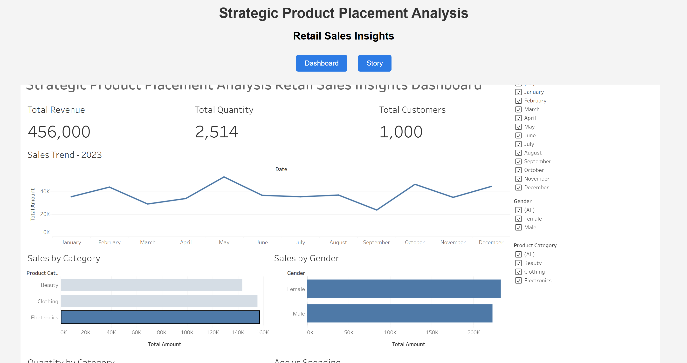

# Strategic Product Placement Analysis

## Overview

This project analyzes retail sales data to understand how product placement and customer behavior impact sales performance. The analysis was performed using **Tableau**, and the final dashboard and story were embedded into a **Flask web application** to create an interactive analytics interface.

The goal of this project is to uncover insights from retail sales data and present them through clear visualizations that help businesses make data-driven decisions.

---

## Problem Statement

Retail businesses often struggle to identify which product categories and customer segments contribute most to their revenue. This project aims to analyze retail sales data and uncover insights related to:

* Product category performance
* Customer demographics
* Sales trends over time
* Purchasing patterns

By visualizing this data, businesses can improve product placement strategies and optimize sales performance.

---

## Dataset

The dataset used for this project is a **Retail Sales Dataset** obtained from Kaggle.

Dataset link:
https://www.kaggle.com/datasets/mohammadtalib786/retail-sales-dataset

Key columns in the dataset include:

* Transaction ID
* Date
* Customer ID
* Gender
* Age
* Product Category
* Quantity
* Price per Unit
* Total Amount

---

## Tools and Technologies

The following tools were used in this project:

* **Tableau Public** – Data visualization and dashboard creation
* **Python** – Backend development
* **Flask** – Web application framework
* **HTML / CSS** – User interface design
* **Git & GitHub** – Version control and project hosting

---

## Tableau Visualizations

Several visualizations were created to analyze retail sales data, including:

* Sales by Product Category
* Sales by Gender
* Sales Trend Over Time
* Quantity Sold by Category
* Age vs Spending Analysis

These visualizations were combined into a **Tableau Dashboard** and further explained through a **Tableau Story**.

---

## Dashboard Preview



---

## Tableau Public Link

You can view the interactive Tableau dashboard and story here:

https://public.tableau.com/views/StrategicProductPlacementAnalysis_17729092472330/Dashboard1?:language=en-US&:sid=&:redirect=auth&:display_count=n&:origin=viz_share_link

---

## Flask Web Application

To make the analysis accessible through a web interface, the Tableau dashboard and story were embedded into a **Flask application**.

The Flask UI includes:

* Navigation buttons to switch between Dashboard and Story
* Embedded Tableau visualizations
* Clean and simple interface for viewing insights

---

## Project Structure

```
strategic-product-placement-analysis
│
├── app.py
├── README.md
│
├── templates
│   └── index.html
│
├── dataset
│   └── retail_sales_dataset.csv
│
└── screenshots
    └── dashboard.png
```

---

## How to Run the Project

1. Clone the repository

```
git clone https://github.com/ADITYAKIRAN890/strategic-product-placement-analysis.git
```

2. Navigate to the project folder

```
cd strategic-product-placement-analysis
```

3. Install Flask

```
pip install flask
```

4. Run the Flask application

```
python app.py
```

5. Open the application in your browser

```
http://127.0.0.1:5000
```

---

## Key Insights

From the analysis, several insights were discovered:

* Certain product categories generate significantly higher revenue.
* Customer demographics influence purchasing behavior.
* Sales trends reveal seasonal patterns in retail demand.
* Data visualization helps identify opportunities for optimizing product placement strategies.

---

## Conclusion

This project demonstrates how **data visualization and web integration** can be used together to analyze retail sales data effectively. By combining **Tableau dashboards with a Flask web application**, the project provides an interactive way to explore sales insights and support data-driven decision making.

---

## Author

Aditya Kiran Shukla
Yukta Arora

GitHub:
https://github.com/ADITYAKIRAN890
